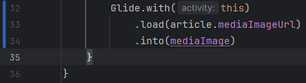

# Lab 4: Article Search

Course Link: [CodePath Android Course](https://courses.codepath.org/courses/and102/unit/4#!labs)

Submitted by: **Pooja Loganathan**

**Article Search** is an app designed to display the most recent articles from the NY Times.

Time spent: **4** hours spent in total

## Application Features

### Required Features

The following **required** functionality is completed:

- [X] (3 pts) **Articles are displayed using the RecyclerView.**
    - 

- [X] (4 pts) **Can navigate to the Article Details screen.**
    - 

- [X] (3 pts) **Article images are downloaded and displayed using Glide.**
    - 

### Stretch Features

The following **stretch** functionality is implemented:

- [X] (+2 pts bonus) **Enhanced the UI for the application with customized fonts and ConstraintLayout for each of the screens.**
    - 

## Notes

Describe any challenges encountered while building the app. <!-- Replace this with your specific challenges and experiences -->

## Resources

- [Using Intents to Create Flows](https://guides.codepath.org/android/Using-Intents-to-Create-Flows)
- [AsyncHTTPClient](https://guides.codepath.org/android/Using-CodePath-Async-Http-Client)
- [GridLayoutManager](https://developer.android.com/reference/kotlin/androidx/recyclerview/widget/GridLayoutManager)
- [GridView in Android](https://www.geeksforgeeks.org/gridview-in-android-with-example/)
- GIF created with [CloudConvert](https://cloudconvert.com/)

## License

```plaintext
    Copyright [2024] [Pooja Loganathan]

    Licensed under the Apache License, Version 2.0 (the "License");
    you may not use this file except in compliance with the License.
    You may obtain a copy of the License at

        http://www.apache.org/licenses/LICENSE-2.0

    Unless required by applicable law or agreed to in writing, software
    distributed under the License is distributed on an "AS IS" BASIS,
    WITHOUT WARRANTIES OR CONDITIONS OF ANY KIND, either express or implied.
    See the License for the specific language governing permissions and
    limitations under the License.